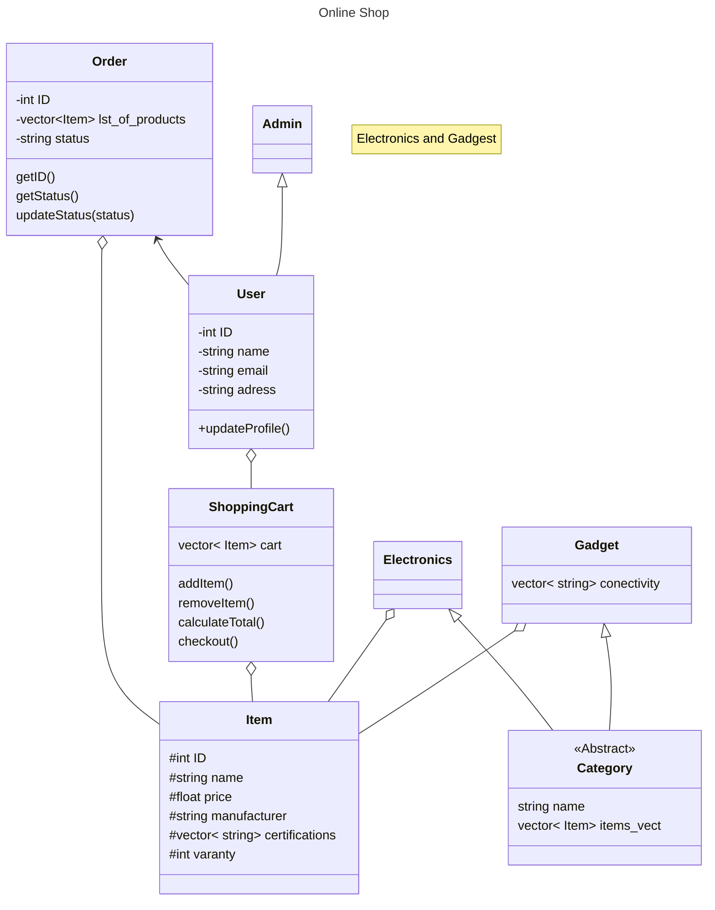

```mermaid


---
title: Online Shop
---
classDiagram
    note "Electronics and Gadgest"
    class Category
    <<Abstract>> Category
    Category : string name
    Category : vector< Item>  items_vect

    
    class Item
    Item : #int ID
    Item : #string name
    Item : #float price
    Item : #string manufacturer
    Item : #vector< string> certifications
    Item : #int varanty

    class User
    User : -int ID
    User : -string name
    User : -string email
    User : -string adress
    User: +updateProfile()
    
    class ShoppingCart
    ShoppingCart : vector< Item> cart
    ShoppingCart: addItem()
    ShoppingCart: removeItem()
    ShoppingCart: calculateTotal()
    ShoppingCart: checkout()

    class Order
    Order : -int ID
    Order : -vector~Item~ lst_of_products
    Order : -string status
    Order: getID()
    Order: getStatus()
    Order: updateStatus(status)

    
    Order <-- User
    Order o-- Item
    Admin <|-- User
    class Admin
    


    User o-- ShoppingCart
    ShoppingCart o-- Item

    Electronics<|-- Category
    Electronics o-- Item
    Gadget o-- Item

    Gadget<|-- Category
    Gadget : vector< string> conectivity


```

